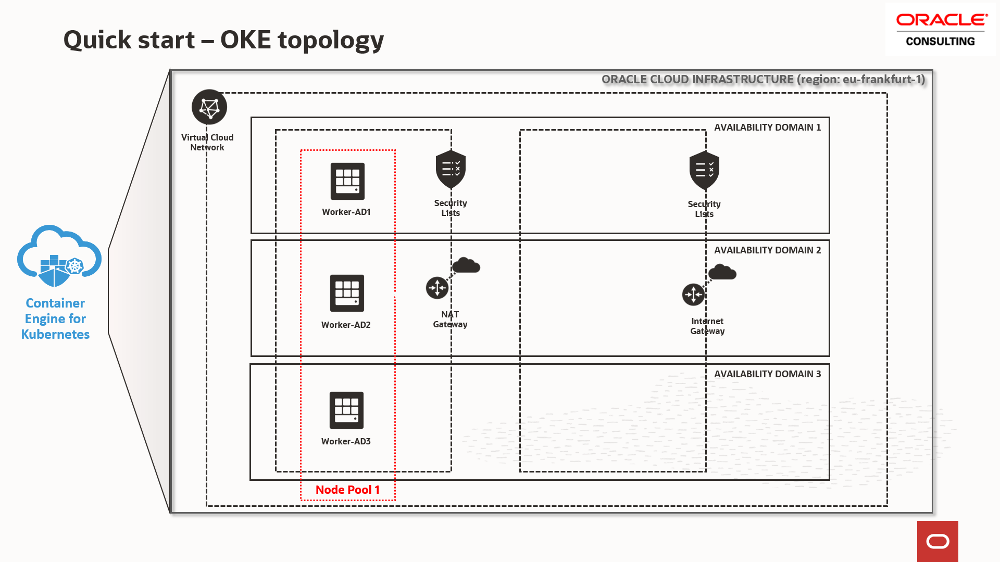
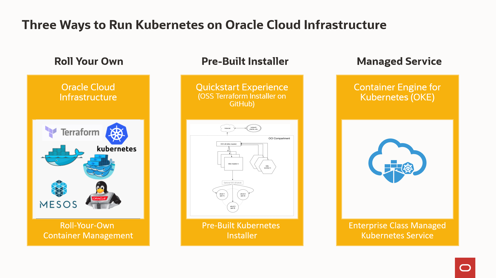
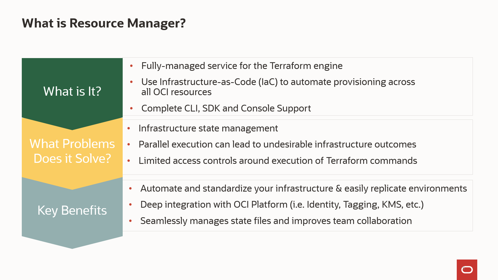

# Applicazioni Cloud Native: Oracle in azione - Demo 1

## Agenda

- Creazione di un cluster Oracle Container Engine for Kubernetes tramite quick-start 
- Policy di sicurezza OCI per la creazione di un cluster Oracle Container Engine for Kubernetes 
- Oracle Cloud Infrastructure Registry
- Amministrazione del cluster oke tramite OCI Cloud-Shell
- Installazione di un deployment ed esposizione di un servizio con Load Balancer pubblico
- Modalità di creazione di un cluster OKE su OCI
- Resource Manager

## Provisioning di un cluster Oracle Container Engine for Kubernetes tramite quick-start



## Policy di sicurezza per la creazione di un cluster OKE e accesso ad OCIR

Una policy è un entità che specifica chi può accedere alle risorse Oracle Cloud Infrastructure e come. Una policy consente semplicemente agli utenti appartenenti ad un gruppo di lavorare con specifici privilegi con determinati tipi di risorse in un particolare compartment o nel tenant.

Le seguenti policy di sicurezza devono essere assegnate al gruppo dell'utente che deve creare un Container Engine Kubernetes:

```
Allow group <group-name> to manage instance-family in <location>
Allow group <group-name> to use subnets in <location>
Allow group <group-name> to read virtual-network-family in <location>
Allow group <group-name> to use vnics in <location>
Allow group <group-name> to inspect compartments in <location>
```

 'catch-all' policy:

```
Allow group <group-name> to manage cluster-family in <location>
```

La seguenti policy di sicurezza devo essere assegnate al gruppo dell'utente che deve eseguire pull e push delle immagini docker da un Oracle Cloud Infrastructure Registry (OCIR)

```
Allow group <group-name> to use repos in tenancy
```


https://docs.cloud.oracle.com/en-us/iaas/Content/ContEng/Concepts/contengpolicyconfig.htm

## Oracle Cloud Infrastructure Registry

Oracle Cloud Infrastructure Registry è un registro gestito da Oracle che semplifica la memorizzazione, la condivisione e la gestione di artefatti di sviluppo come immagini Docker.

- creiamo il repository "webinar-repo" di tipo privato
- associano un auth token all'utenza OCI che eseguirà il pull & push delle immagini docker


Proviamo ora ad eseguire il push di un'immagine docker sul nostro OCIR:

```bash
docker pull nginx
```

```bash
docker image ls
```

```bash
docker tag <image-id> <region-key>.ocir.io/<tenancy-namespace>/<repo-name>/<image-name>:<tag> 
```

```bash
#e.g. docker tag  nginx:latest fra.ocir.io/frgp31lum6jg/cnawebinar/nginx:1.0.0
```


```bash
docker login <region-key>.ocir.io 
```

```bash
#e.g. docker login fra.ocir.io
```


```bash
docker push <region-key>.ocir.io/<tenancy-namespace>/<repo-name>/<image-name>:<tag> 
```

```bash
#e.g. docker push fra.ocir.io/frgp31lum6jg/cnawebinar/nginx:1.0.0
```

## Amministrazione del cluster oke tramite OCI cloud shell

- avviare la cloud shell
- eseguire il comando oci cli per download del kubeconfig file, e.g.

```bash
oci ce cluster create-kubeconfig --cluster-id <cluster-ocid> --file $HOME/.kube/config --region eu-frankfurt-1 --token-version 2.0.0s
```

- utilizzo dell'utility *kubectl* per verificare il corretto accesso al cluster, e.g.

  ```bash
  kubect get nodes
  ```

  ```
  kubectl get pod,svc,secret,cm -A
  ```

  

## Installazione di un deployment con nginx e di un servizio con Load Balancer pubblico

Creazione del secret per pull da OCIR:

```bash
kubectl create secret docker-registry regcred --docker-server=<your-registry-server> --docker-username=<your-name> --docker-password=<your-pword> --docker-email=<your-email> 
```

```bash
#e.g. kubectl create secret docker-registry regcred --docker-server=fra.ocir.io --docker-username=frgp31lum6jg/oracleidentitycloudservice/fpacilio@gmail.com --docker-password="<auth token>" --docker-email=fpacilio@gmail.com
```


Creazione di un deployment nginx:

```yaml
cat <<EOF | kubectl apply -f -
apiVersion: apps/v1
kind: Deployment
metadata:
  labels:
    app: nginx-deploy
  name: nginx-deploy
  namespace: default
spec:
  replicas: 1
  selector:
    matchLabels:
      app: nginx-deploy
  strategy:
    rollingUpdate:
      maxSurge: 25%
      maxUnavailable: 25%
    type: RollingUpdate
  template:
    metadata:
      creationTimestamp: null
      labels:
        app: nginx-deploy
    spec:
      imagePullSecrets:
      - name: regcred	
      containers:
      - image: fra.ocir.io/frgp31lum6jg/cnawebinar/nginx:1.0.0
        imagePullPolicy: IfNotPresent
        name: nginx
EOF
```

Esposizione del servizio e creazione di un LBaaS pubblico

```bash
kubectl expose deployment nginx-deploy --name=nginx-service --type=LoadBalancer --port=80
```

```bash
kubectl describe svc nginx-service
```

```shell
IP=$(kubectl get svc nginx-service --output jsonpath='{.status.loadBalancer.ingress[0].ip }'); echo http://$IP
```

## Modalità **di** **creazione** **di un cluster OKE** **su** OCI



Repository Terraform per OKE: https://github.com/oracle-terraform-modules/terraform-oci-oke

## Resource Manager

