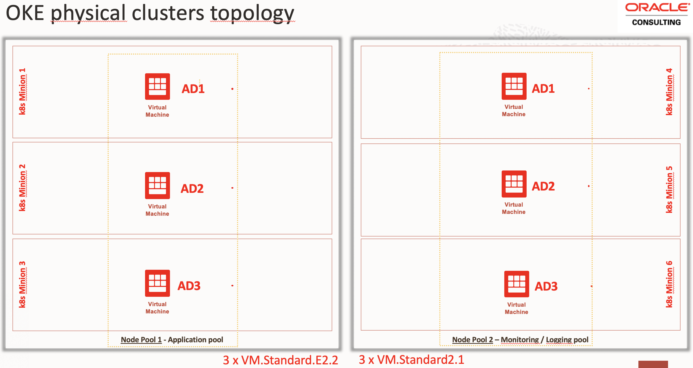
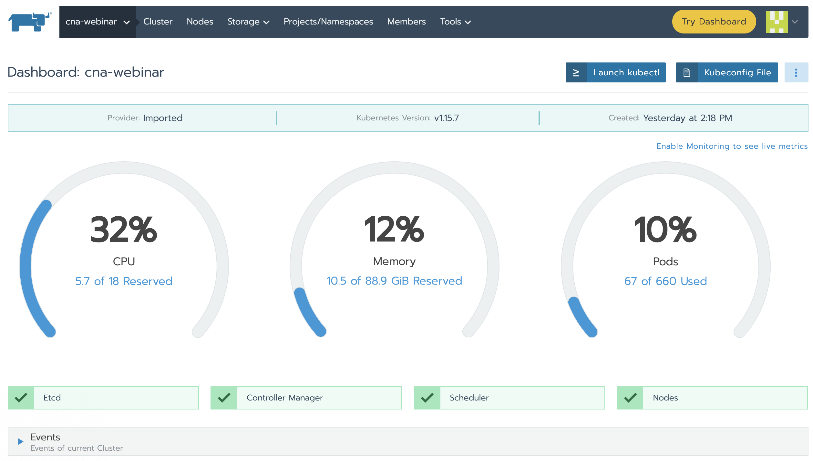
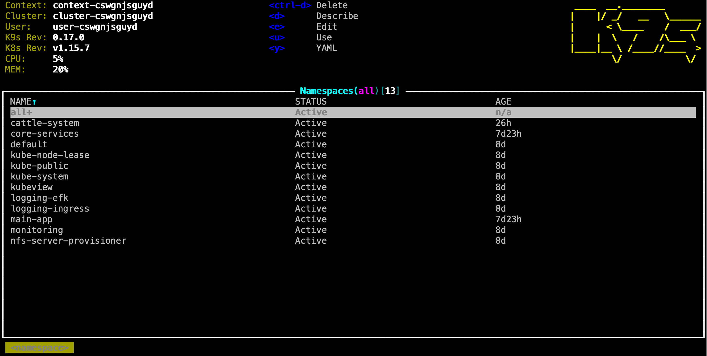
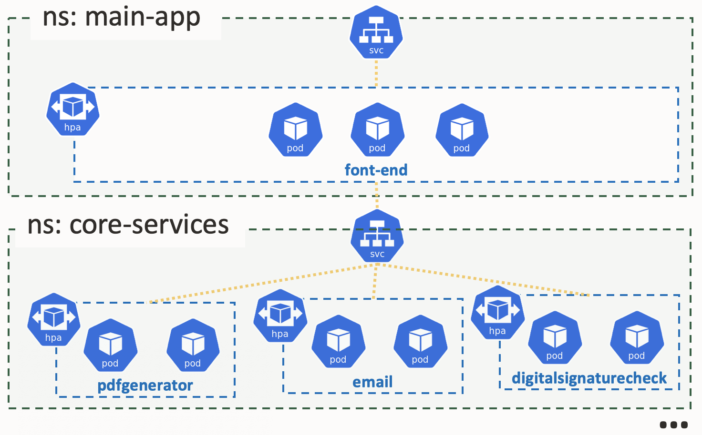

# Applicazioni Cloud Native: Oracle in azione - Demo 2

## Agenda

1. Overview del sistema utilizzato per questa demo
2. CNA tools
3. K8S horizontal scaling
4. CI/CD via Wercker

## 1. Overview del sistema

Questa l'architettura utilizzata nella Demo 2.



Su questa architettura sono deployati diverse applicazioni e tools.


Utilizzando la shell di una macchina Linux *bastion* con accesso pubblico si visualizzano le caratteristiche del sistema:

```bash
kubectl get no
```
```bash
kubectl get no -L node-type
```
Sui nodi monitoring-node=true sono installati i tool:
```bash
kubectl get namespace
```

In ogni namespace si trova una applicazione specifica.

Ad esempio Grafana / Prometheus sono nel `namespace = monitoring`:
```bash
kubectl get pod -n monitoring
```
Stesso risultato si puo vedere in maniera piu agevole anche tramite k9s:
```bash
~/k9s
```

## 2. CNA tools

Utilizzeremo i seguenti tools:

### A. Rancher

Classic Rancher view



New Rancher dashboard


### B. Grafana / Prometheus


### C. Kibana / ElasticSearch


### D. KubeView


### E. k9s



## 3. K8S horizontal scaling

### Sample application overview

La seguente figura illustra la Sample application nella quale verra' indotto stress:



Per vedere i componenti deployati nel cluster che sottintendano la Sample application (due namespaces) si possono usare i seguenti comandi:
```bash
kubectl get deployment,pod,hpa,services,endpoints -n main-app -owide
```
```bash
kubectl get deployment,pod,hpa,services,endpoints -n core-services -owide
```

### Monitoring

Per monitorare il sistema durante il carico si può usare il seguente comando (da lanciare su altra shell rispetto a quella in cui si lancia il 'siege'):

```bash
watch -n 1 "kubectl top no && kubectl get hpa,po -n core-services"
```
```bash
~/k9s
```

Oppure i seguenti tool:

* Rancher
* KubeView
* Grafana
  * Dashboard Cluster
  * Dashboard Nodes
* Kibana
  * Mostrare le varie "Search"

### Stress del sistema

Si lancia il carico sul sistema con il seguente comando:


```bash
siege -c 10 -r 10000 "http://130.61.206.200/LoadOKE/TestOKEService?servlist=email-service.core-services.svc.cluster.local:8080,pdf-generation-service.core-services.svc.cluster.local:8080,digitalsignchecker-service.core-services.svc.cluster.local:8080&threadnum=5,5,5&elabtime=100,100,100&errperc=10,5,10"
```

Dopo alcuni minuti di carico il sistema raggiunge il regime (massimi valori impostati nel hpa i.e. 10 pod per deployment).

## CI/CD con Wercker

Useremo il seguente processo semplificato come template per implementare un la nostra pipeline CI/CD.


Si mostrano i componenti del sistema:

- <u>Developer IDE</u>: tramite il quale gli sviluppatori gestiscono / modificano una applicazione denominata *MedRecAPI* che implementa delle REST API sviluppate in Java
- La pipeline <u>Werker</u>
- <u>Developer Cloud Services</u> (DevCS) usato per il GIT
- <u>Wercker</u> come motore CI/CD (build, test, deploy)
- <u>OCIR</u> come registry per le immagini
- <u>OKE</u> (lo stesso cluster già usato prima)
- La nostra applicazione *MedRecAPI*REST API tramite Swagger UI:
  - Test delle funzionalità di base di una applicazione REST API con CRUD

<br/>

L'applicazione REST API containerizzata e' deployata sullo stesso cluster OKE nel namespace *default*.

```bash
kubectl get po,svc
```

<br/>

La logica di fondo e' la seguente:

1. Lo sviluppatore modifica il codice e modifica i test unitari:
   1. incremento dei record utilizzati per fare il test unitario
   2. Cambio del nome dell'applicazione

2. Usando IDE lo sviluppatore fa commit e push del codice su GIT (DevCS)

3. Il GIT server su DevCS viene aggiornato

4. Grazie al webhook di Werker sul GIT viene triggerata una pipeline che alla fine produrrà una nuova immagine
5. La nuova immagine una volta testata viene pushata su OCIR
6. Alla fine Wercker fa il deployment su OKE della nuova Docker image tramite il manifest salvato su GIT

<br/>

Durante il deployment si usano i seguenti strumenti per monitorare il `rolling rollout`(su due shell distinte):
```bash
watch -n 1 kubectl get deployment,po -owide
```
```bash
kubectl get po -w
```

```bash
~/k9s
```

<br/>

Per vedere gli item ritornati dalla API `/admin/all` si può usare:

```bash
curl -s -X GET --header 'Accept: application/json' 'http://158.101.176.210:8080/admin/all'|jq
```
Oppure in un loop (solo la size dell'array):
```bash
while true; do env TZ=Europe/Rome date  ;curl -s -X GET --header 'Accept: application/json' 'http://158.101.176.210:8080/admin/all'|jq length; sleep 2; done
```


Dopo il deployment si verifica che l'applicazione sia effettivamente cambiata tramite Swagger UI.


